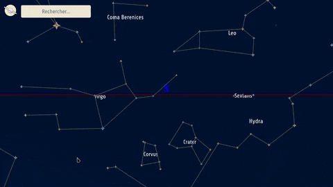

# Interstellai.re

This web application offers an interactive 3D skymap and an animated 3D model of the solar system.



Made by [Rémi BOURGEON](https://www.github.com/remicmacs/) & [Rodolphe HOUDAS](https://www.gihub.com/rodolpheh/) at [ISEN Lille](https://www.isen-lille.fr/).

Planets and moones are not to scale.

Displayed planets do not include dwarf planets and trans-neptunian objects.

Displayed moons are the main moons of each planets, according to data used as reference (see below, [Credits section](#Credits)).

The web application is up and running at [https://interstellai.re](https://interstellai.re) !

## Review my code
We very much like feedback on our work, and we are aware that some of the features are broken and needs more work done (e.g. the drag and drop list only drags and drops in Firefox).

So feel free to write us to share your thoughts. However we probably won't care for feature requests, as this is a school project.

## Getting started
The dev environment used is composed of a VM provisionned and orchestrated with Vagrant and Puppet. The [website PuPHPet] provides the Puppet configuration for provisionning the VM.

### First deployment

#### Requirements

* Virtualbox
* Vagrant >= 2.0

#### Deployment

```bash
# unzip the vagrantbox.zip file in the local folder.
$ unzip vagrantbox.zip
# Launch set_hosts.sh script
$ sudo sh sethosts.sh
# Powering VM and provisionning it with Vagrant
$ vagrant up
```

Once the Vagrant box is up and running, some configuration is needed inside the VM to deploy back-end correctly.

```bash
# Step inside the Vagrant box
$ vagrant ssh
# Move to web root
(@stellarisen-lamp) $ cd /var/www/stellarisen
# Launch deployment script
(@stellarisen-lamp) $ ./deployment_inside.sh
```

### Use of Vagrant box

The root of the Vagrant environment is the folder including `Vagrantfile` and the `.vagrant` folder. All Vagrant commands must be launched from the Vagrant root folder.

#### Main commands

Starting and provisionnig the development server

```shell
$ vagrant up
```

Force provisionning of the Vagrant box after modification of its configuration

```shell
$ vagrant provision
```

Cleanly suspend the development server

```shell
$ vagrant suspend
```

Force kill the production server (might break things)

```shell
$ vagrant halt
```

When there is a problem

```sh
$ # You can go grab a coffee
$ vagrant destroy && vagrant up
```

Connect to vagrant box session

```sh
$ vagrant ssh
```

[More informations on this page](https://puphpet.com/#help)

### Debug JS in Firefox

Debbugging client-side JS code requires extensions in editors like Atom and VS Code. Some IDEs like Webstorm include a connector by default.

* [VS Code extension](https://github.com/hbenl/vscode-firefox-debug)

Add this configuration with theses properties in the IDE debugger :


For more information on the Firefox Debugger, see [this MDN page](https://developer.mozilla.org/en-US/docs/Tools/Debugger).

Debugging can be done directly inside the browser through the [dev tools](https://developer.mozilla.org/en-US/docs/Tools/Debugger).

### PHP & XDebug

All XDebug server configuration is taken care of in the Vagrant box configuration generated by PuPHPet. All XDebug settings can be tweaked in the `puphpet/config.yaml` file and applied with `vagrant provision`. Most of it is taken care of and will work out of the box. If debugging does not start, it most likely is a client problem.

#### With VS Code

The configuration properties for all IDE's and editor's debbugers might look
like this JSON file :

```json
    {
      "name": "Listen for XDebug",
      "type": "php",
      "request": "launch",
      "port": 9000,
      //Your project's path in the server
      "pathMappings": {
          "/var/www/stellarisen/": "${workspaceFolder}/",
      },
      "stopOnEntry": true
    }
```

This example is specifically the debugger configuration for VS Code, but all debuggers needs roughly the same informations.

Some might need extensions. VS Code needs `php-debug` extension to be able to work.

#### With Atom
With Atom, packages `php-debug` and `atom-debug-ui` are recommended to use XDebug. The `atom-ide-ui` debug panel won't work with php-debug, so it is recommendend to disable it during PHP debugging to avoid confusion between breakpoints set by `atom-debug-ui` and `atom-ide-ui`'s debugger.

Settings > atom-ide-ui > Enabled features > Enable debugger > set to "Never
enabled"

The extension needs to now the path mappings of the local files to the remote
server files.

The mappings is stored in a JSON object. For example :

```json
[
	{
		"localPath":"/the/absolute/path/to/stellarisen",
		"remotePath":"/var/www/stellarisen"
	},
	{
		"remotePath":"/var/www/stellarisen/testfolder",
		"localPath":"/the/absolute/path/to/stellarisen/testfolder"
	}
]
```

With VS Code, one can use the `php-debug` extension that is better integrated
with the native debugger of the editor.

Configuration of the debugger then is stored with other debugger configuration
in file `.vscode/launch.json` :

```json
{
  "version": "0.2.0",
  "configurations": [
    {
      // ... Other configurations, like for client-side JS debugging
    },
    {
      "name": "Listen for XDebug",
      "type": "php",
      "request": "launch",
      "port": 9000,
      //Your project's path in the server
      "pathMappings": {
          "/var/www/stellarisen/": "${workspaceFolder}/",
      },
      "stopOnEntry": true
    }
  ]
}
```

### Recovering server dependancies

The [Composer dependancy manager](https://getcomposer.org/) is used to retrieve
all libraries needed by the API, including development server.

In `${StellarisenRoot}/api` folder :

```shell
$ composer install
```

This command is taken care of by the `deploy_inside.sh` script which the user should have launch at first deployment. However, one can remove PHP dependanies and reinstall them to ensure the correct version of vendor packages is provided.

## Documentation

> Documentation is a love letter you write to your future self.
> - *Damian Conway*

Here lives the documentation of the project.

- [Client JS single page application](docs/FRONT-END.md)
- [Lumen HTTP REST API](docs/API.md)
- [Tools](docs/TOOLS.md)
- [Project management and choices](docs/PROJECT_MANAGEMENT.md)

## Credits

We thank all people and organization for the already existing tools and data that helped us create this school project.

Planets and moons data are from NASA :

* [Planets](https://nssdc.gsfc.nasa.gov/planetary/factsheet/)
* [Moon](https://nssdc.gsfc.nasa.gov/planetary/factsheet/moonfact.html)
* [Moons of Mars](https://nssdc.gsfc.nasa.gov/planetary/factsheet/marsfact.html)
* [Moons of Jupiter](https://nssdc.gsfc.nasa.gov/planetary/factsheet/joviansatfact.html)
* [Moons of Saturn](https://nssdc.gsfc.nasa.gov/planetary/factsheet/saturniansatfact.html)
* [Moons of Uranus](https://nssdc.gsfc.nasa.gov/planetary/factsheet/uraniansatfact.html)
* [Moons of Neptune](https://nssdc.gsfc.nasa.gov/planetary/factsheet/neptuniansatfact.html)

Star position on the skymap is in [J.2000](https://en.wikipedia.org/wiki/Epoch_(astronomy)#Julian_years_and_J2000). It is the position of stellar objects on the January 1st, 2000.

Star data is from [the HYG database](https://github.com/astronexus/HYG-Database).

Data on constellations and moons and planets textures comes from [Stellarium](https://stellarium.org/). Be sure to check out this amazing, inspiring piece of open-source software !!

[PuPHPet](https://puphpet.com/) is a tool made by [Juan Treminio](https://jtreminio.com/).

