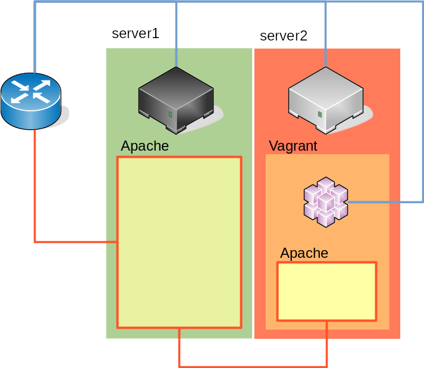

# System

Since we were already possessing two servers, we decided to self-host our website. The two servers are located at the same place. One is already in use for personal services, and the other one, which is more recent, was a clean install of Arch Linux without any server software in place. We also used a Vagrant box for our development environment so we thought we could use it for the deployment.



In the drawing above, the blue links are physical or soft network connections. The vagrant box is connected to the router through a Virtualbox bridge connection. The red links represents the way followed by an incoming HTTP packet to interstellai.re.

We choose this setting as to not disrupt as less as possible the current service (except for the occasional Apache's reboot between changes in configuration). This would also need minimum changes to the current Vagrant box.

## Vagrant box

The Vagrant box needed a few changes :

* Set the network to a bridged connection :

```bash
# In puphpet/config.yaml, line 26, replace the network
# configuration for this one :
network:
    public_network: '1'
```

* Change the auto-configured vhost and add a vhost for the HTTPS access:

```bash
# On line 198, change the line for:
servername: interstellai.re

# On line 221, add:
vhost2:
	servername: interstellai.re
	docroot: /var/www/stellarisen
	port: '443'
	setenvif:
		- 'Authorization "(.*)" HTTP_AUTHORIZATION=$1'
	ssl: '1'
	directories:
		php_html:
		    provider: directory
		    path: /var/www/stellarisen
		    directoryindex: 'index.php index.html'
		        options:
		            - Indexes
		            - FollowSymlinks
		            - MultiViews
		         allow_override:
		            - All
		         require:
		            - 'all granted'
		         php_php:
		            provider: filesmatch
		            path: \.php$
		            sethandler: 'proxy:fcgi://127.0.0.1:9000'
```

After provisioning the Vagrant box and launching the deployment scripts, it is ready for use.

## Router configuration

The router is a simple consumer ISP box. A static lease is assigned to the Vagrant box, to assure stability. The port 443 is redirected from the WAN interface to the server1.

## server1 vhost configuration

To redirect all the traffic to server2, we have to make a reverse proxy binded on interstellai.re. This will redirect to an internal IP through the instructions `ProxyPass`, `ProxyPassReverse`, and `ProxyPreserveHost` to preserve hostname.

The SSL engine is then enabled and an SSL proxy is enabled and configured to accept the self-signed certificate generated by the Vagrant box. This will assure that the traffic will stay encrypted even on the internal network.

We then set the path for certificates files and configure a few settings to advertise the client that the HTTPS traffic is forwarded.

```bash
#################
# interstellai.re
#################
<VirtualHost *:443>
    ServerAdmin houdas.rodolphe@gmail.com
    ServerName interstellai.re

    ProxyPass / https://192.168.0.16/
    ProxyPassReverse / https://192.168.0.16/
    ProxyPreserveHost On

    SSLEngine On
    SSLProxyEngine On
    SSLProxyVerify none
    SSLProxyCheckPeerCN off
    SSLProxyCheckPeerName off
    SSLProxyCheckPeerExpire off

    SSLCertificateFile "/etc/letsencrypt/live/interstellai.re/cert.pem"
    SSLCertificateKeyFile "/etc/letsencrypt/live/interstellai.re/privkey.pem"
    SSLCertificateChainFile "/etc/letsencrypt/live/interstellai.re/fullchain.pem"

    <Location />
        RequestHeader set X-Forwarded-Proto https
        RequestHeader set X-Forwarded-Ssl on
        RequestHeader set X-Url-Scheme https
    </Location>

    <Proxy>
        Order Allow,Deny
        Allow from all
    </Proxy>

    ErrorLog "/var/log/httpd/interstellai.re-error_log"
</VirtualHost>
```

Just to assure that any access on port 80 or on www.interstellai.re will be redirected to interstellai.re on port 443, we added this snippet :

```bash
<VirtualHost *:80>
    ServerName www.interstellai.re
    Redirect / https://interstellai.re
</VirtualHost>

<VirtualHost *:80>
    ServerName interstellai.re
    Redirect / https://interstellai.re
</VirtualHost>

<VirtualHost *:443>
    ServerName www.interstellai.re
    Redirect / https://interstellai.re
</VirtualHost>
```

## SSL Certificates

The certificates was obtained through Let's Encrypt:

```bash
certbot certonly --apache -d interstellai.re -d www.interstellai.re
```
